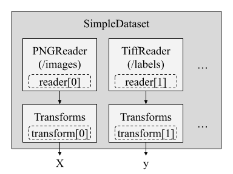

# Minerva: A Modular Framework for Time-Series and Seismic ML

Minerva is a flexible framework built on PyTorch and PyTorch Lightning to support machine learning tasks involving time-series, seismic data, and self-supervised learning. 
It offers tools for data management, training, evaluation, and reproducibility in ML pipelines.

## Data Handling

Minerva simplifies data management using a custom wrapper around PyTorch Lightning’s `LightningDataModule`. 
This class, called `MinervaDataModule`, provides structured access to both datasets and dataloaders.

In fact, this class:

- Integrates seamlessly with PyTorch Lightning's `Trainer`.
- Supports any map-style PyTorch dataset.
- Allows full access to both datasets and dataloaders, useful for analysis purposes.
- Configurations using YAML or other external config files as well as using Python code.

### Structure

`MinervaDataModule` organizes training, validation, and testing datasets, and provides corresponding dataloaders.
Thus, user must instantiate a `MinervaDataModule` by passing the datasets and other configurations (e.g., batch size, shuffling, etc.).

For instance, to create a `MinervaDataModule` with a torch-like map-style dataset, using train, validation, and test datasets, the user can do the following:

```python
from minerva.data.data_modules.base import MinervaDataModule

train_ds = MyTrainDataset()
val_ds = MyValDataset()
test_ds = MyTestDataset()

data_module = MinervaDataModule(
    train_dataset=train_ds,
    val_dataset=val_ds,
    test_dataset=test_ds,
    batch_size=16,
    drop_last=True
)
```

User can acess the datasets and dataloaders using the following methods and properties:

| Method/Property     | Purpose                                   |
|---------------------|-------------------------------------------|
| `train_dataset`     | Dataset used for training                 |
| `val_dataset`       | Dataset used for validation               |
| `test_dataset`      | Dataset used for testing                  |
| `train_dataloader()`| Returns training dataloader               |
| `val_dataloader()`  | Returns validation dataloader             |
| `test_dataloader()` | Returns testing dataloader                |

The dataloaders are create using configurations passed to the `MinervaDataModule` constructor.
You may check the `MinervaDataModule` class for more details on the available configurations.

### Why Not Just Use `LightningDataModule`?

While `LightningDataModule` provides access only to dataloaders, `MinervaDataModule` also exposes the underlying datasets. This makes it easier to:
- Apply dataset-level transformations or analysis
- Visualize raw samples
- Customize data preparation logic

## Minerva Datasets and Readers

Minerva's design philosophy emphasizes modularity and reusability. This is particularly important when dealing with datasets that may have different storage formats or structures.
Minerva uses `MinervaDataModule` to allow training and evaluating models, create pipelines, and conduct experiments.
As shown above, this class is instantiated passing the datasets and other configurations.
The dataset can be any map-style PyTorch dataset, which is a common format for datasets in PyTorch.

Although Minerva supports any map-style dataset, it also provides a custom dataset class called `SimpleDataset` that is designed to be minimal and modular.
This class is a wrapper around the `torch.utils.data.Dataset` class and allows users to create datasets easily by specifying a list of readers and transformations, as illustrate in the example below.



A Reader can be viewed as a component that loads a single data unit (e.g., an image, label, or time series) from a source (e.g., disk, memory, network, table, table column, numpy array, folder, etc.) in a pre-defined order. In the example above, the `SimpleDataset` class uses two readers: one for loading images (`PNGReader`) and another for the labels (`TiffReader`). Also, each reader can be associated with a transformation (e.g., `ToTensor`, `Normalize`) that is applied to the data unit after it is loaded.
Once a `__getitem__` method is called, the `SimpleDataset` class will load the data units from the readers in the order specified and apply the transformations to each data unit. Finally, it returns a tuple of the transformed data units.
Thus, we can instantiate a `SimpleDataset` class by passing a list of readers and transformations, as shown in the example below.

```python
from minerva.data.readers.patched_array_reader import NumpyArrayReader
from minerva.transforms.transform import Repeat, Squeeze
from minerva.data.datasets.base import SimpleDataset

root_data_dir = Path("f3/data/")

train_data_reader = NumpyArrayReader(
    data=root_data_dir / "train" / "train_seismic.npy",
    data_shape=(1, 701, 255),
)

train_labels_reader = NumpyArrayReader(
    data=root_data_dir / "train" / "train_labels.npy",
    data_shape=(1, 701, 255),
)

train_dataset = SimpleDataset(
    readers=[train_data_reader, train_labels_reader],
    transforms=[Repeat(axis=0, n_repetitions=3), None],
)

print(train_dataset)
```

We will get the following output:

```
==================================================
           📂 SimpleDataset Information            
==================================================
📌 Dataset Type: SimpleDataset
   └── Reader 0: NumpyArrayReader(samples=401, shape=(1, 701, 255), dtype=float64)
   │     └── Transform: Repeat(axis=0, n_repetitions=3)
   └── Reader 1: NumpyArrayReader(samples=401, shape=(1, 701, 255), dtype=uint8)
   │     └── Transform: None
   │
   └── Total Readers: 2
==================================================
```

Thus, in the example above, where we have two readers, the `SimpleDataset` class will load the data units from the first reader (the seismic data) and apply the `Repeat` transformation to it. Then, it will load the data units from the second reader (the labels) without applying any transformation. The resulting dataset will contain tuples of the form `(seismic_data, labels)`. The pseudocode below illustrates how the `SimpleDataset` class works:

```
1. Load the i-th data unit from first reader
2. Apply the first list of transformation to the data unit
3. Load the i-th data unit from second reader
4. Apply the second list of transformation to the data unit
5. Return the tuple of the two data units
```

> **NOTE**: The `SimpleDataset` class is not mandatory, but it is a good practice to use it for maintainability and flexibility. It allows you to create datasets easily by specifying a list of readers and transformations, making your data pipeline clean and consistent.


The example above shows how to create a `SimpleDataset` class using two readers, which could be two images, that may be used for training a model for image segmentation, for instance.
However, this is easilly extensible to any other type of data. Minerva provides a set of readers for loading data from different sources, such as:
- `NumpyArrayReader`: Loads data from a numpy array.
- `TabularReader`: Loads data from a tabular format with predefined columns, in row-order. 
- `CSVReader`: Loads data from a CSV file, with predefined columns, in row-order.
- `TiffReader`: Loads data from a TIFF file.
- `PNGReader`: Loads data from a PNG file.
- Among others.


## Example

Check out the [Getting Started with Minerva for Seismic Facies Classification notebook](notebooks/seismic_facies_getting_started.ipynb) for a complete example of how to use Minerva for training a model using the `SimpleDataset` class and the `MinervaDataModule` class.