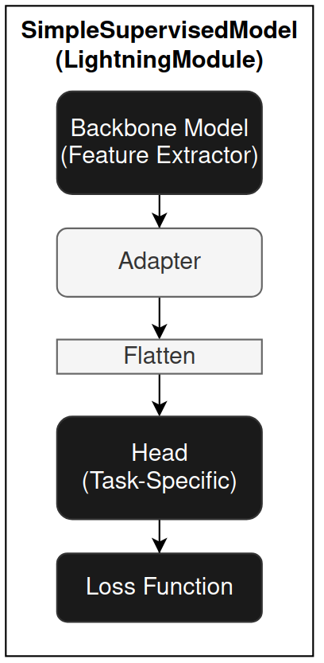

# Minerva Design

Minerva is a flexible framework built on PyTorch and PyTorch Lightning to support machine learning tasks involving time-series, seismic data, and self-supervised learning. 
It offers tools for data management, training, evaluation, and reproducibility in ML pipelines.


## Data Handling

Minerva simplifies data management using a custom wrapper around PyTorch Lightning’s `LightningDataModule`. 
This class, called `MinervaDataModule`, provides structured access to both datasets and dataloaders.

In fact, this class:

- Integrates seamlessly with PyTorch Lightning's `Trainer`.
- Supports any map-style PyTorch dataset.
- Allows full access to both datasets and dataloaders, useful for analysis purposes.
- Configurations using YAML or other external config files as well as using Python code.

### Structure

`MinervaDataModule` organizes training, validation, and testing datasets, and provides corresponding dataloaders.
Thus, user must instantiate a `MinervaDataModule` by passing the datasets and other configurations (e.g., batch size, shuffling, etc.).

For instance, to create a `MinervaDataModule` with a torch-like map-style dataset, using train, validation, and test datasets, the user can do the following:

```python
from minerva.data.data_modules.base import MinervaDataModule

train_ds = MyTrainDataset()
val_ds = MyValDataset()
test_ds = MyTestDataset()

data_module = MinervaDataModule(
    train_dataset=train_ds,
    val_dataset=val_ds,
    test_dataset=test_ds,
    batch_size=16,
    drop_last=True
)
```

User can acess the datasets and dataloaders using the following methods and properties:

| Method/Property     | Purpose                                   |
|---------------------|-------------------------------------------|
| `train_dataset`     | Dataset used for training                 |
| `val_dataset`       | Dataset used for validation               |
| `test_dataset`      | Dataset used for testing                  |
| `train_dataloader()`| Returns training dataloader               |
| `val_dataloader()`  | Returns validation dataloader             |
| `test_dataloader()` | Returns testing dataloader                |

The dataloaders are create using configurations passed to the `MinervaDataModule` constructor.
You may check the `MinervaDataModule` class for more details on the available configurations.

### Why Not Just Use `LightningDataModule`?

While `LightningDataModule` provides access only to dataloaders, `MinervaDataModule` also exposes the underlying datasets. This makes it easier to:
- Apply dataset-level transformations or analysis
- Visualize raw samples
- Customize data preparation logic

### Minerva Datasets and Readers

Minerva's design philosophy emphasizes modularity and reusability. This is particularly important when dealing with datasets that may have different storage formats or structures.
Minerva uses `MinervaDataModule` to allow training and evaluating models, create pipelines, and conduct experiments.
As shown above, this class is instantiated passing the datasets and other configurations.
The dataset can be any map-style PyTorch dataset, which is a common format for datasets in PyTorch.

Although Minerva supports any map-style dataset, it also provides a custom dataset class called `SimpleDataset` that is designed to be minimal and modular.
This class is a wrapper around the `torch.utils.data.Dataset` class and allows users to create datasets easily by specifying a list of readers and transformations, as illustrate in the example below.


A Reader can be viewed as a component that loads a single data unit (e.g., an image, label, or time series) from a source (e.g., disk, memory, network, table, table column, numpy array, folder, etc.) in a pre-defined order. In the example above, the `SimpleDataset` class uses two readers: one for loading images (`PNGReader`) and another for the labels (`TiffReader`). Also, each reader can be associated with a transformation (e.g., `ToTensor`, `Normalize`) that is applied to the data unit after it is loaded.
Once a `__getitem__` method is called, the `SimpleDataset` class will load the data units from the readers in the order specified and apply the transformations to each data unit. Finally, it returns a tuple of the transformed data units.
Thus, we can instantiate a `SimpleDataset` class by passing a list of readers and transformations, as shown in the example below.

```python
from minerva.data.readers.patched_array_reader import NumpyArrayReader
from minerva.transforms.transform import Repeat, Squeeze
from minerva.data.datasets.base import SimpleDataset

root_data_dir = Path("f3/data/")

train_data_reader = NumpyArrayReader(
    data=root_data_dir / "train" / "train_seismic.npy",
    data_shape=(1, 701, 255),
)

train_labels_reader = NumpyArrayReader(
    data=root_data_dir / "train" / "train_labels.npy",
    data_shape=(1, 701, 255),
)

train_dataset = SimpleDataset(
    readers=[train_data_reader, train_labels_reader],
    transforms=[Repeat(axis=0, n_repetitions=3), None],
)

print(train_dataset)
```

We will get the following output:

```
==================================================
           📂 SimpleDataset Information            
==================================================
📌 Dataset Type: SimpleDataset
   └── Reader 0: NumpyArrayReader(samples=401, shape=(1, 701, 255), dtype=float64)
   │     └── Transform: Repeat(axis=0, n_repetitions=3)
   └── Reader 1: NumpyArrayReader(samples=401, shape=(1, 701, 255), dtype=uint8)
   │     └── Transform: None
   │
   └── Total Readers: 2
==================================================
```

Thus, in the example above, where we have two readers, the `SimpleDataset` class will load the data units from the first reader (the seismic data) and apply the `Repeat` transformation to it. Then, it will load the data units from the second reader (the labels) without applying any transformation. The resulting dataset will contain tuples of the form `(seismic_data, labels)`. The pseudocode below illustrates how the `SimpleDataset` class works:

```
1. Load the i-th data unit from first reader
2. Apply the first list of transformation to the data unit
3. Load the i-th data unit from second reader
4. Apply the second list of transformation to the data unit
5. Return the tuple of the two data units
```

> **NOTE**: The `SimpleDataset` class is not mandatory, but it is a good practice to use it for maintainability and flexibility. It allows you to create datasets easily by specifying a list of readers and transformations, making your data pipeline clean and consistent.


The example above shows how to create a `SimpleDataset` class using two readers, which could be two images, that may be used for training a model for image segmentation, for instance.
However, this is easilly extensible to any other type of data. Minerva provides a set of readers for loading data from different sources, such as:
- `NumpyArrayReader`: Loads data from a numpy array.
- `TabularReader`: Loads data from a tabular format with predefined columns, in row-order. 
- `CSVReader`: Loads data from a CSV file, with predefined columns, in row-order.
- `TiffReader`: Loads data from a TIFF file.
- `PNGReader`: Loads data from a PNG file.
- Among others.


## Models

Minerva offers a collection of pre-defined models and architectures for supervised learning. Each model typically consists of two primary components (but is not mandatory):

* **Backbone**: Responsible for feature extraction.
* **Head**: Performs the task-specific prediction (e.g., classification, regression).

These components are usually implemented as separate classes to encourage flexibility and reusability, though this separation is not strictly required. All components can be built using either PyTorch or PyTorch Lightning modules and are fully compatible with standard PyTorch workflows.

The final model (used for training and evaluation) is generally a combination of a backbone and a head. This composite model is always implemented as a `LightningModule`, and it expects a `MinervaDataModule` instance as its data source. Thus, the Lightning `Trainer` can be used to train and evaluate the model, passing the `LightningModule` and `MinervaDataModule` instances to it.

### The `SimpleSupervisedModel` Class

To simplify the creation of supervised learning models, Minerva provides the `SimpleSupervisedModel` class, a high-level composition utility that allows users to define a model by simply passing in the backbone and head.

`SimpleSupervisedModel` is a subclass of `LightningModule` and internally follows this structure:



The key components and parameters of `SimpleSupervisedModel` are:

* **`backbone`**: A PyTorch or PyTorch Lightning module that extracts features from the input. It can be randomly initialized or pre-trained.
* **`head (fc)`**: A task-specific fully connected (FC) head module. It can also be initialized from scratch or pre-trained.
* **`loss`**: A PyTorch-compatible loss function (e.g., `CrossEntropyLoss`, `MSELoss`). Used to compute the training loss.
* **`adapter`** *(optional)*: A callable that transforms the output of the backbone to a suitable format for the head. This is useful when there's a mismatch between backbone output and head input. The adapter can be a lambda, function, or module that receives the backbone output tensor and returns a tensor and returns the transformed tensor.
* **`flatten`** *(optional, boolean)*: If `True` (default), flattens the backbone (or adapter, if any) output before feeding it into the head. This is commonly needed when the output is multi-dimensional.

In addition to these, you can optionally pass optimizers, learning rate schedulers, and evaluation metrics to customize training behavior.

`SimpleSupervisedModel` supports a wide range of use cases, including transfer learning, and its modular structure makes it easy to extend or integrate with other components.

### Model Organization

Models in Minerva reside in the `minerva.models.nets` module and are further organized into domain-specific submodules:

* `minerva.models.nets.time_series`: Models for time-series data.
* `minerva.models.nets.image`: Models for image data.

Many of these models implement the `SimpleSupervisedModel` interface. While the backbone and head are often defined as separate classes in same file, this is not a strict requirement.


## Self-Supervised Learning (SSL)

Minerva also includes a suite of self-supervised learning (SSL) techniques, available in the `minerva.models.ssl` module.

In order to interoperate with Lightning Trainer and other components, all SSL methods are implemented as subclasses of `LightningModule`. Thus, they are all considered models and are compatible with the `MinervaDataModule` class, which is used to load the data for training and evaluation.
Wherever possible, SSL models follow a compositional design, allowing users to pass backbone modules during initialization for greater flexibility and reusability, although this is not a strict requirement.


## Constructor-Based Initialization

Minerva uses a constructor-based approach to initialize its core components, such as models, datasets, and data modules. Wherever possible, components are configured via constructors that accept parameters, enabling flexible customization and consistent behavior.

This design makes it easy to instantiate components programmatically or from configuration files (e.g., YAML). As a result, Minerva components often expose a large number of parameters. To maintain usability, we prioritize clear documentation of all parameters and their default values.

## Training Loop

Minerva uses PyTorch Lightning's `Trainer` class to handle the training loop. Thus, any customizations or configurations for the training loop can be done using the `Trainer` class. From supervised learning to self-supervised learning, Minerva's models are designed to be compatible with the `Trainer` class, using `MinervaDataModule` for data loading.

This design allows using PyTorch Lightning's built-in features, such as:
- Lightning callbacks
- Logging
- Gradient accumulation and clipping
- Mixed precision training
- Distributed training
- Automatic accelerator and device placement


## Loading Models Partially

In PyTorch, checkpoints store a model’s `state_dict`, an **ordered dictionary** containing all of the model's parameters (typically derived from class attributes). This structure allows for selective loading of specific components, making it particularly useful for tasks such as transfer learning or fine-tuning.

For instance, when training a SimCLR SSL model with a DeepLabV3 backbone, the checkpoint usually includes the full model, both the backbone and the projection heads. However, when reusing the backbone for a different task, it’s often desirable to load only the backbone parameters and exclude the rest (e.g., the projection heads). This selective loading is crucial for transfer learning, where you want to leverage pre-trained weights without carrying over task-specific parameters.

Minerva provides a utility class called `FromPretrained` to facilitate this selective loading process. This class allows loading a model from a checkpoint while filtering out unwanted parameters (e.g., those belonging to projection heads). It uses regular expressions to filter and rename `state_dict` keys, enabling fine-grained control over what gets loaded.

Since `FromPretrained` is a class, it uses a constructor-based approach for model initialization. You simply provide the model instance and the checkpoint path, no additional wrapper functions or external logic are required. This encapsulated design promotes reusability, readability, and maintainability. It also integrates seamlessly with other Minerva components such as the `SimpleSupervisedModel` class and YAML-based configuration files.

Below is a simple example using the `FromPretrained` class, where we load a `DeepLabV3` model and selectively initialize only its `backbone` from a checkpoint file.

```python
from minerva.models.nets.image.deeplabv3 import DeepLabV3
from minerva.models.loaders import FromPretrained

checkpoint_path = "path/to/checkpoint.pth"
model = DeepLabV3()
model = FromPretrained(
    model=model,
    ckpt_path=checkpoint_path,
    filter_keys=["^backbone.*"],
    keys_to_rename=None
)
```

In this example, `FromPretrained` loads only the parameters from the checkpoint  whose keys match the regular expression `^backbone.*`, that is, parameters that starts with `backone.` in its name. This effectively excludes any parameters associated with the `fc` (fully connected) head. The optional `keys_to_rename` argument accepts a dictionary to rename or re-map or append keys during loading, useful when adapting checkpoints across slightly different model architectures, such as when the naming conventions differ or when you want to append a prefix or suffix to the keys. You may want to check the `FromPretrained` class for more details on how to use and the available parameters.

> **Note:** The use of `FromPretrained` is optional but strongly recommended for improved flexibility and maintainability. It integrates well with Minerva's `SimpleSupervisedModel` class.

> **Note:** The return value of `FromPretrained` is an instance of the same type as the input model. So, if the input is a `DeepLabV3` instance, the returned object will also be a `DeepLabV3` instance.


## Examples

To see how to use Minerva for different tasks, you can check the [tutorials page](tutorials.rst) for complete examples of how to use Minerva and its components to train and evaluate models.